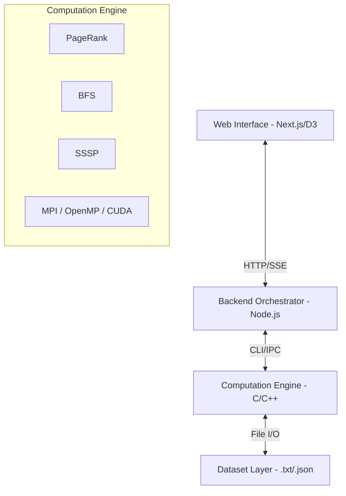

# Temporaloom: Full Project Breakdown & System Documentation

**Temporaloom** is an end-to-end, high-performance graph analytics platform that combines distributed computing, GPU acceleration, and interactive web visualization. This document provides a comprehensive breakdown of the entire system, from data ingestion to parallel processing and final visualization.

---

## 1. Project Overview
Temporaloom is designed to analyze massive graph structures (web topologies, social networks, etc.) by leveraging heterogeneous computing. It solves the performance bottleneck of iterative graph algorithms by parallelizing them across multi-core CPUs, distributed clusters, and GPUs, while providing a modern dashboard for real-time observation of algorithm convergence.

### Key Features
*   **Live Data Ingestion:** Integrated web crawler to build real-time web graphs.
*   **Heterogeneous Compute:** Modular backends for Sequential, MPI, OpenMP, and CUDA.
*   **Real-time Visualization:** D3-force simulations and iteration playback.
*   **Performance Metrics:** Automated benchmarking of speedup, efficiency, and runtime.

---

## 2. System Architecture (End-to-End)

The system is organized into a four-tier vertical stack:

### Components
1.  **Frontend (Next.js/React):** The command center. Users select datasets, configure algorithm parameters (damping factor, iteration limits, source nodes), and watch the graph evolve.
2.  **Backend (Node.js/App Router):** The bridge. It parses user requests, generates CLI commands for the C binaries, and streams stdout/stderr back to the UI.
3.  **Compute Engine (C/C++):** The muscle. Highly optimized binaries that implement graph kernels using parallel libraries.
4.  **Data Layer:** Stores adjacency lists and result JSONs. Includes a custom graph generator for benchmarking scale-free networks.

---

## 3. Core Modules Breakdown

### A. Data Acquisition (Web Scraper)
*   **Logic:** Uses `cheerio` in the Next.js API layer.
*   **Flow:** Starts at a seed URL → Recursively visits links up to a defined depth → Generates an adjacency list (`source_id destination_id`).
*   **Output:** Saves a `.txt` dataset compatible with the C engine.

### B. The Parallel Compute Engine
The engine (located in `/engine`) is multi-paradigm:
*   **Sequential (`_seq`):** Baseline implementation used for correctness verification and speedup calculation.
*   **MPI (`_mpi`):** Distributed memory parallelism. It partitions the graph $N$ nodes among $P$ processes. Uses `MPI_Allreduce` to synchronize rank contributions globally.
*   **OpenMP (`_omp`):** Shared memory parallelism. Uses `#pragma omp parallel for` to distribute inner loops of PageRank and BFS across CPU cores.
*   **CUDA (`_cuda`):** Massively parallel GPU acceleration. Each node in the graph is mapped to a GPU thread to perform high-speed rank summations.

### C. The Visualization Layer
*   **Force-Directed Graph:** Built with `d3-force`. Nodes are color-coded based on their rank (PageRank) or distance (BFS/SSSP).
*   **Iteration Playback:** A state-management system that captures the output of each algorithm step, allowing the user to "scrub" through the algorithm's convergence history.

---

## 4. Algorithm Implementation Details

### PageRank
*   **Mathematical Model:** $PR(u) = \frac{1-d}{N} + d \sum_{v \in B_u} \frac{PR(v)}{L(v)}$
*   **Optimization:** Handles "dangling nodes" (nodes with no out-links) by redistributing their rank equally across the network to maintain mass conservation.

### Breadth-First Search (BFS)
*   **Parallel Strategy:** Level-synchronous BFS. In each step, all nodes at distance $k$ expand their neighbors to distance $k+1$ in parallel.

### Single Source Shortest Path (SSSP)
*   **Implementation:** Dijkstra-like approach for unweighted/weighted graphs with parent tracking to enable full path reconstruction from any target back to the source.

---

## 5. Data Interoperability
The system uses a strict IPC (Inter-Process Communication) protocol:
1.  **Input:** C engine accepts dataset path + configuration flags (e.g., `-j` for JSON mode, `-s` for source node).
2.  **Output:** The engine emits structured JSON to `stdout`.
3.  **Streaming:** The Node.js backend reads this stream and sends it to the frontend via **Server-Sent Events (SSE)**, ensuring the UI doesn't freeze during long computations.

---

## 6. Performance & Scalability
Temporaloom accounts for the **Communication vs. Computation** trade-off:
*   **Small Graphs:** Sequential execution is often faster due to zero communication overhead.
*   **Large Graphs:** MPI and CUDA show significant (sub-linear to linear) speedup as the computation-to-communication ratio increases.
*   **Metrics Tracked:** Execution Time (s), Throughput (Edges/s), Speedup ($T_1/T_p$), and Efficiency ($S/P$).

---

## 7. Future Roadmap
*   **Phase 1 (Complete):** Core PageRank with MPI and Basic UI.
*   **Phase 2 (Complete):** Breadth-First Search and SSSP integration.
*   **Phase 3 (Ongoing):** Multi-node Cluster testing and dynamic graph updates.
*   **Phase 4 (Future):** Integrated Graph Query Language (GQL) support and persistent database storage for massive crawls.
