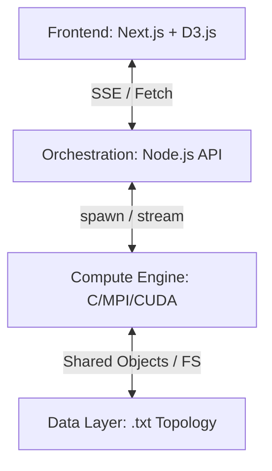

# Temporaloom: Full-Cut Implementation Details

This document provides a deep-dive into the technical architecture, data flow, and algorithmic implementation of the **Temporaloom** graph analytics engine.

---

## 1. System Architecture Overview

Temporaloom is built on a 4-tier hybrid architecture designed for mass-parallel execution and real-time visualization.



### Key Tiers
1.  **The UI Tier (React):** Uses D3.js and Framer Motion to visualize topology and performance. It handles the state for live comparisons and dashboard analytics.
2.  **The Orchestration Tier (Next.js API):** Manages process spawning. It uses the `child_process` module to trigger MPI or CUDA executables and pipes their `stdout` into an SSE stream.
3.  **The Compute Tier (C Kernel):** Consists of optimized C kernels. Algorithms are implemented in Sequential, MPI (Distributed), and OpenMP (Multi-threaded) versions.
4.  **The Data Tier:** Uses a coordinate-based `.txt` format (`# nodes edges \n source target`) for high-speed ingestion of large datasets.

---

## 2. Distributed Engine Implementation

### A. PageRank (MPI Version)
The PageRank implementation uses the **Iterative Power Method** with a damping factor (default 0.85).

#### **Logic Flow (Pseudocode):**
```c
InitializePR(ranks, n); // Set all to 1/N
while (!converged && iter < max_iter) {
    local_dangling_sum = 0;
    for (i = local_start; i < local_end; i++) {
        compute_contributions(i, outgoing_nodes, &local_new_ranks, &local_dangling_sum);
    }
    
    // Global Synchronization
    MPI_Allreduce(local_dangling_sum, global_dangling_sum, SUM);
    MPI_Allreduce(local_new_ranks, global_ranks, SUM);
    
    // Apply Damping and Convergence Check
    diff = ApplyGlobalUpdates(global_ranks, global_dangling_sum);
    if (diff < EPSILON) converged = true;
}
```

### B. BFS (Level-Synchronous Parallel)
To explore the graph in parallel, we use a **Level-Synchronous Expansion** strategy.

#### **Logic Flow (Pseudocode):**
```c
distance[source] = 0;
while (any_new_nodes_found) {
    memset(local_visited, 0, n);
    for (v = local_start; v < local_end; v++) {
        if (distance[v] == current_level) {
            for (neighbor : neighbors(v)) {
                if (distance[neighbor] == INF) local_visited[neighbor] = 1;
            }
        }
    }
    
    // Sync newly discovered nodes
    MPI_Allreduce(local_visited, global_new_nodes, MAX);
    
    update_distances(global_new_nodes);
    current_level++;
}
```

---

## 3. Data Flow & Streaming Logic

### Real-Time Visualization (SSE)
Since C executions can take several seconds to converge, we use **Server-Sent Events (SSE)** to show progress "lively."

1.  **C Engine:** Writes JSON blocks to `stdout` periodically (e.g., every iteration of PageRank).
2.  **Node.js API:** Listens to the `stdout` stream.
    - Captures chunks: `data: {"iteration": 5, "nodes": [...]} \n\n`
    - Immediately forward chunks to the browser client.
3.  **Frontend:** Buffers the JSON events and updates the D3 force simulation and performance charts.

```javascript
// Example streaming pipe (API side)
const process = spawn('mpirun', ['-np', cores, './pagerank_mpi', dataset]);
process.stdout.on('data', (chunk) => {
    controller.enqueue(`data: ${chunk.toString()}\n\n`);
});
```

---

## 4. UI/UX Logic & Optimization

### High-Density Dataset Guard
For datasets exceeding **8,000 nodes**, the frontend disables D3 DOM rendering (SVG) as it becomes a bottleneck. Instead:
- It switches to an **Analysis View**.
- It visualizes a random **Sample** of 500 nodes if requested.
- It displays only the converged stats (Nodes, Edges, Avg Degree).

### Comparison Analytics
When running a **Comparative Bench**, the frontend creates an array of active stream readers.
- `Mode 1: Sequential CPU`
- `Mode 2: MPI Cluster (4 Cores)`
- `Mode 3: CUDA Accelerated`
Each reader updates a separate object in the `comparisons` state, allowing for frame-by-frame performance comparisons.

---

## 5. Web Crawler (Scraper) Implementation
The scraper uses `axios` and `cheerio` with a **Dynamic Worker Pool**.

- **Normalization:** Cleans URLs to prevent duplicate nodes.
- **Worker Logic:** Spawns `N` asynchronous workers that pop from a shared queue.
- **Graph Construction:** Every `finished` crawl event returns newly discovered links, which are added to an adjacency set. Once the crawl finishes, this set is written to a `.txt` file in the `datasets/` directory for the C engines to process.
